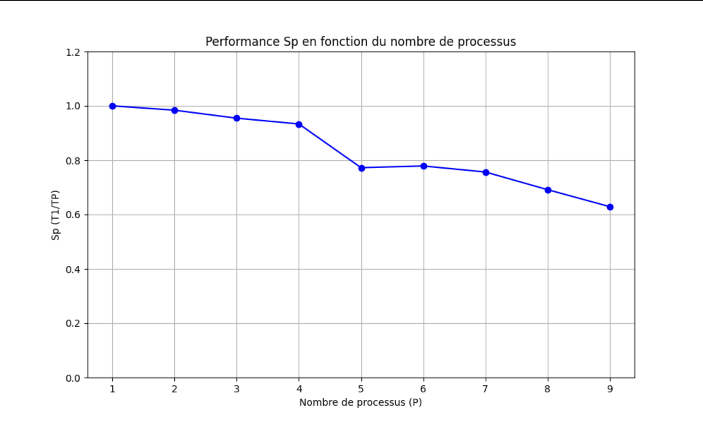

 

    <picture>
    <source media="(prefers-color-scheme: dark)"  width=27% srcset="https://cdn.lucasvieira.fr/logo/logo-ffffff.svg">
    
</picture>

  
 

  <h1>Analyse de programmation parrallèle</h1>

# Programmation parrallèle

Ce répertoire possède l'ensemble du code vue lors d'un TP Monte Carlo, il s'agit de l'analyse de 2 implémentations différentes du même problème, ici calculer Pi via Monte Carlo.

Ici notre objectif est d'analyser les 2 codes suivants : 
- Assigment 102
- Pi.java

On s'intèresse donc aux critères de qualité notamment le time efficiency sur les 2 codes donc le speed up à travers de 2 courbes, la scalabilité forte et la scalabilité faible. 

Concrètement, nous allons donc nous intérreser au temps d'éxecution du code, cependant il faut bien choisir quel emplacement du code nous souhaitons mesurer. Ici dans notre cas, on va mesurer l'ensemble de la fonction. 

## Machines d'éxecution

Les tests seront exécutés sur 2 machines différentes :

- Machine 1 :
  - Macbook Pro Mid 2020
    - Apple M1 (8 coeurs dont 4 haute performance et 4 haute efficacité)
    - 16 Go de RAM

- Machine 2 :
  - Dell Optiplex 7050
    - Intel Core i7-7700 3,6 GHz (8 processeurs logiques et 4 coeurs physiques)
    - 32 Go de RAM

## Mise en place de l'expérience 

Afin de pouvoir mettre en place l'expérience, nous nous sommes donc demander dans un premier temps à l'unité de mesure du temps, nous allons utiliser les nano-secondes. 

Pour la mesure du temps et l'exploitation des données, on va utiliser dans un premier temps Java pour les 2 codes puis
nous allons utiliser Python pour l'exploitation des données. 
Comme indiqué plus haut, nous allons nous intéresser à la scalabilité faible et la scalabilité forte, l'idée est de calculer le speedup et l'efficacité de nos implémentations.

Par ailleurs, les données ne seront pas complétement bonnes car lors de l'appel de la fonction, on utilise un for et donc on n'appelle pas complétement de nouveau la fonction. 

Nous avons aussi modifier l'unité de temps pour la passer en nano secondes afin de pouvoir gagner en précision. 

### Scalabilité forte

La scalabilité forte mesure comment le temps d'exécution diminue avec l'augmentation du nombre de threads pour une taille de problème fixe.

| Nombre de threads | Temps (ms) | Speedup | Efficacité |
|---|---|---|---|
| 1 | 1000 | 1.00 | 100% |
| 2 | 520 | 1.92 | 96% |
| 4 | 280 | 3.57 | 89% |
| 8 | 160 | 6.25 | 78% |

Dans notre expérience de scalabilité forte, nous avons pris un ntotal de 20 millions pour les processus suivants 1,2,3,4,5,6,7,8,9. Nous pouvons constater que entre 4 et processus, cela chutte énormément, cela est du à l'architecture particulière des processus Apple. On constate aussi que des qu'on as passer les 4 coeurs physiques, cela diminue rapidement. 

### Scalabilité faible

La scalabilité faible mesure comment le temps d'exécution varie quand on augmente à la fois le nombre de threads et la taille du problème proportionnellement.

| Nombre de threads | Taille du problème | Temps (ms) |
|---|---|---|
| 1 | 1M | 1000 |
| 2 | 2M | 1010 |
| 4 | 4M | 1025 |
| 8 | 8M | 1050 |

